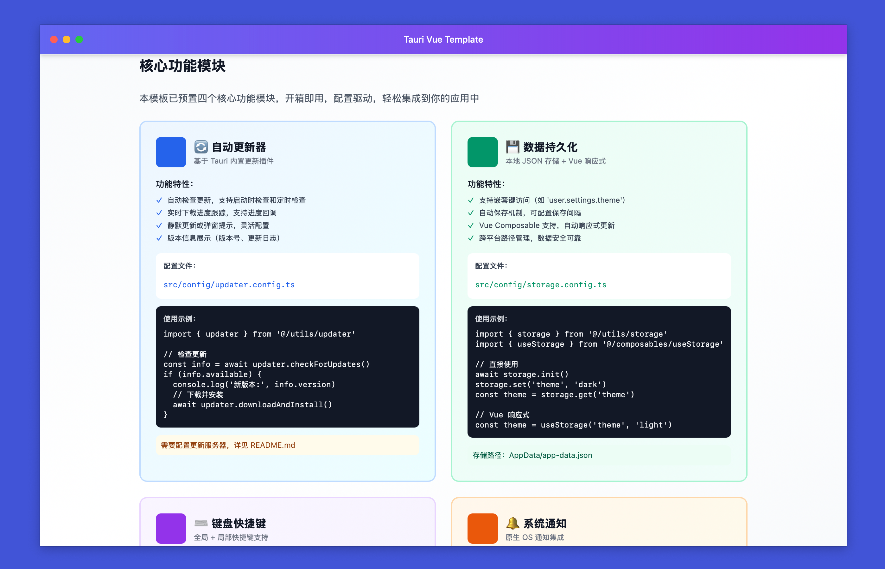

<h1 align="center">PixelPunk</h1>

<p align="center">
  <strong>A Modern Desktop Application Development Template based on Tauri 2.0 + Vue 3 + TypeScript</strong>
</p>

<p align="center">
  Ready to Use · Configuration Driven · Feature Complete
</p>

<p align="center">
  English | <a href="./docs/README_CN.md">简体中文</a>
</p>

<p align="center">
  <a href="#features">Features</a> •
  <a href="#quick-start">Quick Start</a> •
  <a href="#core-modules">Core Modules</a> •
  <a href="#documentation">Documentation</a>
</p>

---

## Preview

<div align="center">
  
  <p><i>Configuration Driven · Four Core Modules Ready to Use</i></p>
</div>

## Features

### 🎯 Core Modules

This template includes four enterprise-grade functional modules, all configuration-driven and ready to use:

- **🔄 Auto Updater** - Version checking, download progress, auto-installation
- **💾 Data Persistence** - Local storage, nested access, Vue reactivity
- **⌨️ Shortcuts System** - Global/local shortcuts, cross-platform support
- **🔔 System Notifications** - Native notifications, permission management, shortcut methods

### ✨ Complete Features

- **🎯 Floating Ball** - File drag & drop upload, real-time progress, draggable, always on top
- **🎨 Custom Window** - macOS-style title bar, transparent window support
- **🔔 System Tray** - Multi-level menu groups, fully configurable
- **📦 Lightweight & Efficient** - Rust-based, small size, excellent performance
- **🛠️ Configuration Driven** - TypeScript config auto-synced to Rust
- **💅 Code Standards** - ESLint + Prettier + Husky out of the box

## Tech Stack

```
Frontend:  Vue 3.5 + TypeScript 5.8 + Vite 7.1 + Tailwind CSS 3.4
Backend:   Tauri 2.8 + Rust 1.70+
State:     Pinia 3.0
```

## Quick Start

### Prerequisites

- Node.js 20.19+ or 22.12+
- Rust 1.70+
- System dependencies: See [Tauri Prerequisites](https://tauri.app/v2/guides/prerequisites/)

### Installation

```bash
# Clone the project
git clone <your-repo-url>
cd pixelpunk

# Install dependencies
npm install

# Development mode
npm run tauri:dev

# Build application
npm run tauri:build
```

## Core Modules

This template includes four ready-to-use core modules. For detailed usage, see **[Development Guide](./docs/DEVELOPMENT.md)**.

| Module              | Features                                       | Config File                      |
| ------------------- | ---------------------------------------------- | -------------------------------- |
| 🔄 Auto Updater     | Version check, download progress, auto-install | `src/config/updater.config.ts`   |
| 💾 Data Persistence | Local storage, nested access, Vue reactivity   | `src/config/storage.config.ts`   |
| ⌨️ Shortcuts System | Global/local shortcuts, configuration-driven   | `src/config/shortcuts.config.ts` |
| 🔔 Notifications    | Native notifications, permission management    | `src/utils/notification.ts`      |

## Project Structure

```
pixelpunk/
├── src/                          # Vue frontend
│   ├── config/                   # Config files (main modification point)
│   ├── utils/                    # Utility modules
│   ├── composables/              # Vue Composables
│   ├── features/                 # Feature modules
│   └── views/                    # Page views
│
├── src-tauri/                    # Rust backend
│   ├── src/                      # Rust source code
│   ├── icons/                    # App icons
│   └── app.config.json          # Auto-generated (do not edit manually)
│
└── docs/                         # Documentation
```

## Configuration

All configurations are centralized in `src/config/app.config.ts` and auto-synced to Rust:

```typescript
export const appConfig = {
  name: "Your App Name",
  version: "1.0.0",
  author: "Your Name",
  description: "App description",
  // ... window, tray, float ball configs
};
```

**Config Workflow**: Modify TypeScript config → Run `npm run tauri:dev` → Auto-sync and apply

## Documentation

### 📚 Complete Documentation

- **[Development Guide](./docs/DEVELOPMENT.md)** - Detailed usage guide, API reference, best practices
- **[Plugin Setup](./docs/PLUGINS_SETUP.md)** - Tauri plugin installation and configuration
- **[Icon Guide](./docs/ICON_GUIDE.md)** - Application icon configuration guide
- **[Tray Icon Guide](./docs/TRAY_ICON_GUIDE.md)** - Tray icon design specifications
- **[Changelog](./docs/CHANGELOG.md)** - Version update records
- **[Contributing](./docs/CONTRIBUTING.md)** - How to contribute

### 🎯 Quick Links

- **In-App Documentation** - Launch the app and check the Home page for interactive docs
- **Examples** - Check the `examples/` directory for code samples

## Common Commands

```bash
# Development
npm run tauri:dev        # Development mode (recommended)
npm run dev              # Frontend dev server only

# Build
npm run tauri:build      # Build complete application
npm run build            # Build frontend only

# Configuration
npm run sync:config      # Sync configuration
npm run generate-icons   # Generate icons

# Code Quality
npm run lint             # Code linting
npm run format           # Code formatting
npm run type-check       # Type checking
```

## FAQ

<details>
<summary><strong>Configuration not working?</strong></summary>

Run `npm run sync:config` and restart the app.

</details>

<details>
<summary><strong>How to customize tray menu?</strong></summary>

1. Add menu items in `src/config/app.config.ts`
2. Handle events in `src-tauri/src/lib.rs` `on_menu_event`

See [Development Guide](./docs/DEVELOPMENT.md#tray-configuration) for details.

</details>

<details>
<summary><strong>How to use core modules?</strong></summary>

Check [Development Guide](./docs/DEVELOPMENT.md#core-modules) for detailed usage and code examples for each module.

</details>

<details>
<summary><strong>More questions?</strong></summary>

Check [Development Guide](./docs/DEVELOPMENT.md) or submit an [Issue](../../issues).

</details>

## Contributing

Issues and Pull Requests are welcome! See [Contributing Guide](./docs/CONTRIBUTING.md).

## License

MIT License - See [LICENSE](LICENSE) file for details

---

<p align="center">
  <sub>Built with Tauri 2.0 + Vue 3 · Ready-to-Use Desktop Application Development Template</sub>
</p>
