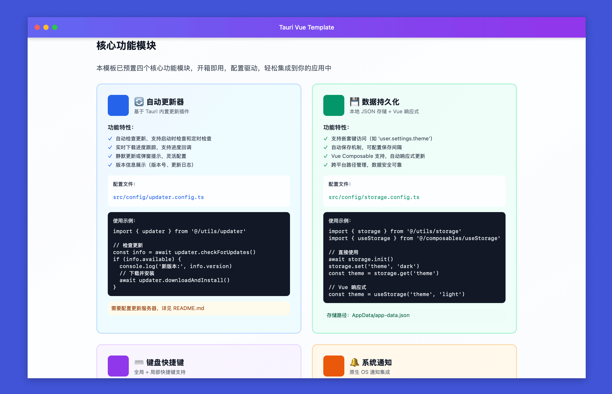

<h1 align="center">PixelPunk</h1>

<p align="center">
  <strong>基于 Tauri 2.0 + Vue 3 + TypeScript 的现代化桌面应用开发模板</strong>
</p>

<p align="center">
  开箱即用 · 配置驱动 · 功能完备
</p>

<p align="center">
  <a href="#特性">特性</a> •
  <a href="#快速开始">快速开始</a> •
  <a href="#核心模块">核心模块</a> •
  <a href="#文档">文档</a>
</p>

---

## 预览

<div align="center">
  
  <p><i>配置驱动 · 四大核心模块开箱即用</i></p>
</div>

## 特性

### 🎯 核心功能模块

本模板预置了四个企业级功能模块，全部基于配置驱动，开箱即用：

- **🔄 自动更新器** - 版本检查、下载进度、自动安装
- **💾 数据持久化** - 本地存储、嵌套访问、Vue 响应式
- **⌨️ 快捷键系统** - 全局/局部快捷键、跨平台支持
- **🔔 系统通知** - 原生通知、权限管理、快捷方法

### ✨ 完整功能

- **🎯 悬浮球** - 文件拖放上传、实时进度、可拖动、始终置顶
- **🎨 自定义窗口** - macOS 风格标题栏、透明窗口支持
- **🔔 系统托盘** - 多级菜单分组、完全可配置
- **📦 轻量高效** - Rust 底层，体积小巧，性能卓越
- **🛠️ 配置驱动** - TypeScript 配置自动同步到 Rust
- **💅 代码规范** - ESLint + Prettier + Husky 开箱即用

## 技术栈

```
Frontend:  Vue 3.5 + TypeScript 5.8 + Vite 7.1 + Tailwind CSS 3.4
Backend:   Tauri 2.8 + Rust 1.70+
State:     Pinia 3.0
```

## 快速开始

### 环境准备

- Node.js 20.19+ 或 22.12+
- Rust 1.70+
- 系统依赖：参考 [Tauri Prerequisites](https://tauri.app/v2/guides/prerequisites/)

### 安装运行

```bash
# 克隆项目
git clone <your-repo-url>
cd pixelpunk

# 安装依赖
npm install

# 开发模式
npm run tauri:dev

# 构建应用
npm run tauri:build
```

## 核心模块

本模板内置四个开箱即用的核心模块，详细使用方法请查看 **[开发文档](./DEVELOPMENT.md)**。

| 模块          | 功能                           | 配置文件                         |
| ------------- | ------------------------------ | -------------------------------- |
| 🔄 自动更新器 | 版本检查、下载进度、自动安装   | `src/config/updater.config.ts`   |
| 💾 数据持久化 | 本地存储、嵌套访问、Vue 响应式 | `src/config/storage.config.ts`   |
| ⌨️ 快捷键系统 | 全局/局部快捷键、配置驱动      | `src/config/shortcuts.config.ts` |
| 🔔 系统通知   | 原生通知、权限管理、快捷方法   | `src/utils/notification.ts`      |

## 项目结构

```
pixelpunk/
├── src/                          # Vue 前端
│   ├── config/                   # 配置文件（主要修改位置）
│   ├── utils/                    # 工具模块
│   ├── composables/              # Vue Composables
│   ├── features/                 # 功能模块
│   └── views/                    # 页面视图
│
├── src-tauri/                    # Rust 后端
│   ├── src/                      # Rust 源码
│   ├── icons/                    # 应用图标
│   └── app.config.json          # 自动生成（勿手动修改）
│
└── docs/                         # 文档
```

## 配置说明

所有配置集中在 `src/config/app.config.ts`，修改后自动同步到 Rust：

```typescript
export const appConfig = {
  name: "你的应用名称",
  version: "1.0.0",
  author: "你的名字",
  description: "应用描述",
  // ... 窗口、托盘、悬浮球等配置
};
```

**配置工作流**：修改 TypeScript 配置 → 运行 `npm run tauri:dev` → 自动同步并应用

## 文档

### 📚 完整文档

- **[开发文档 DEVELOPMENT.md](./DEVELOPMENT.md)** - 详细的使用指南、API 参考、最佳实践
- **[插件安装 PLUGINS_SETUP.md](./PLUGINS_SETUP.md)** - Tauri 插件安装和配置
- **[图标配置 ICON_GUIDE.md](./ICON_GUIDE.md)** - 应用图标配置指南
- **[托盘图标 TRAY_ICON_GUIDE.md](./TRAY_ICON_GUIDE.md)** - 托盘图标设计规范
- **[更新日志 CHANGELOG.md](./CHANGELOG.md)** - 版本更新记录
- **[贡献指南 CONTRIBUTING.md](./CONTRIBUTING.md)** - 如何参与贡献

### 🎯 快速链接

- **应用内文档** - 启动应用查看 Home 页面获取交互式文档
- **在线示例** - 查看 `examples/` 目录获取代码示例

## 常用命令

```bash
# 开发
npm run tauri:dev        # 开发模式（推荐）
npm run dev              # 仅前端开发服务器

# 构建
npm run tauri:build      # 构建完整应用
npm run build            # 仅构建前端

# 配置
npm run sync:config      # 同步配置
npm run generate-icons   # 生成图标

# 代码质量
npm run lint             # 代码检查
npm run format           # 代码格式化
npm run type-check       # 类型检查
```

## 常见问题

<details>
<summary><strong>配置不生效怎么办？</strong></summary>

运行 `npm run sync:config` 后重启应用。

</details>

<details>
<summary><strong>如何自定义托盘菜单？</strong></summary>

1. 在 `src/config/app.config.ts` 中添加菜单项
2. 在 `src-tauri/src/lib.rs` 的 `on_menu_event` 中处理事件

详见 [开发文档](./DEVELOPMENT.md#托盘配置)。

</details>

<details>
<summary><strong>如何使用核心功能模块？</strong></summary>

查看 [开发文档](./DEVELOPMENT.md#核心模块详解) 获取每个模块的详细使用方法和示例代码。

</details>

<details>
<summary><strong>更多问题？</strong></summary>

查看 [开发文档](./DEVELOPMENT.md) 或提交 [Issue](../../issues)。

</details>

## 贡献

欢迎提交 Issue 和 Pull Request！详见 [贡献指南](./CONTRIBUTING.md)。

## 许可证

MIT License - 详见 [LICENSE](LICENSE) 文件

---

<p align="center">
  <sub>基于 Tauri 2.0 + Vue 3 构建 · 开箱即用的桌面应用开发模板</sub>
</p>
